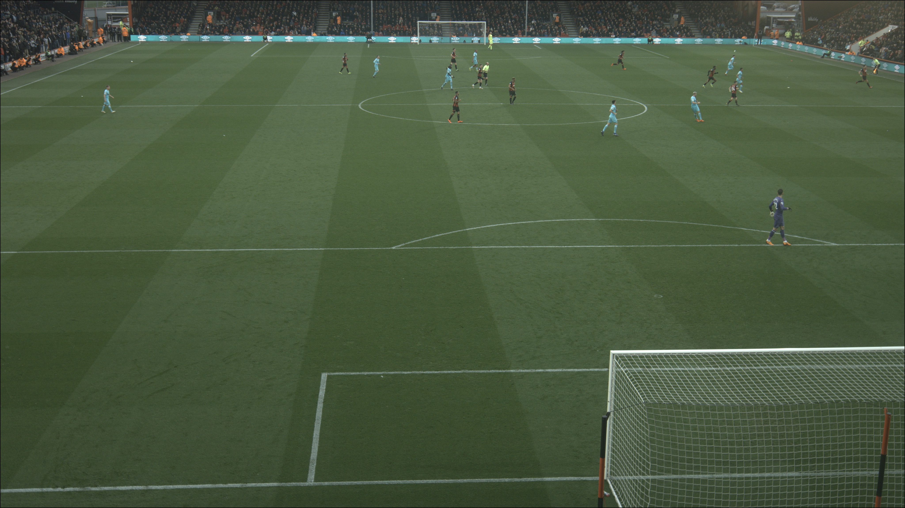
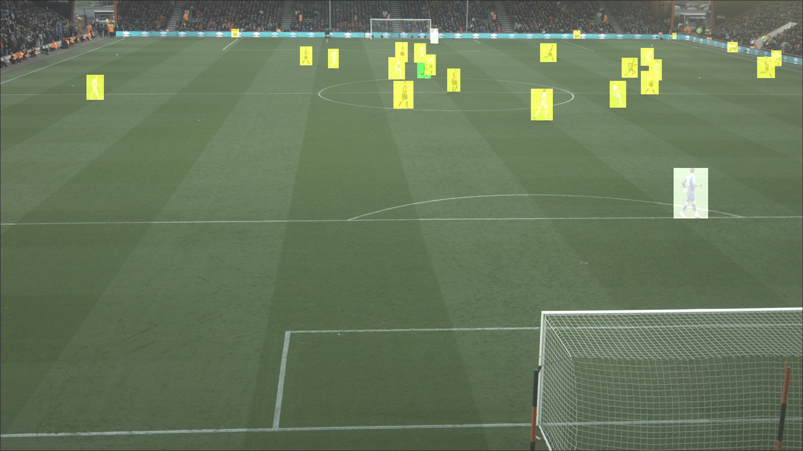
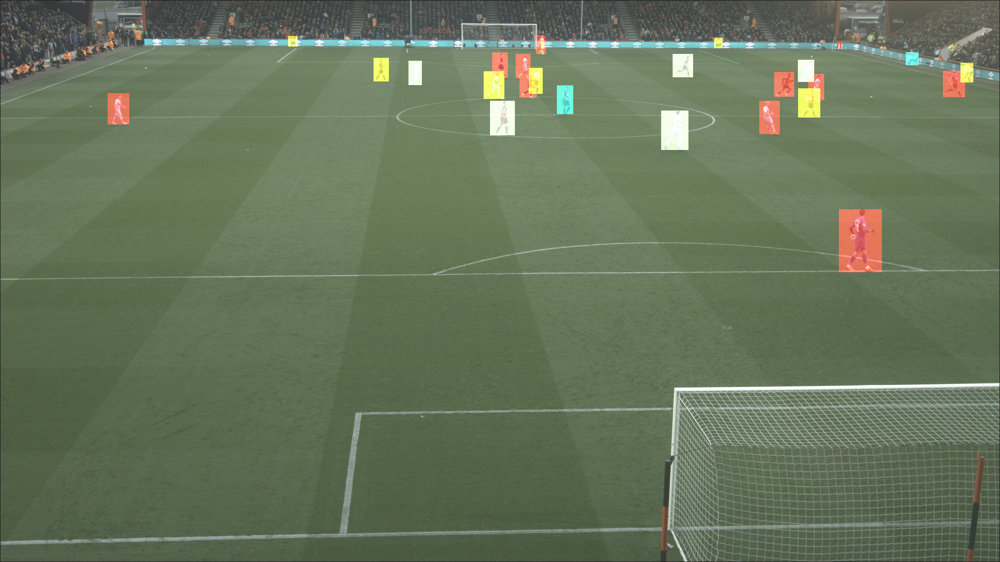

# Hawk-Eye - Player and Team Recognition

This repository contains code to predict the team and player number from an image.

### Directory Structure

```sh
.
├── classification.py                               # Generate the custom dataset and apply transformations
├── Dockerfile
├── group_transactions.py                           # Group entries to select unique phone+ref transactions
├── helpers.py                                      # Check for the validity of directory and images, and split the data in training and validation set.
├── main.ipynb                                      # Main code file
├── model_CNN.ckpt                                  # Trained model
├── prediction.py                                   # Perform the prediction on a single image or directory with images or images path present in the csv file.
├── README.md
├── requirements.txt                                # Packages required
├── transformations.py                              # Various kind of transformations which can be performed on the images.
└── data                                            # Images data
    ├── part1                                       # Directory with images for training the model
    ├── part2                                       # Directory with images and csv file for predictions and shading the images
    ├── test_images                                 # Directory with images for testing the model.
```

### Requirements

- Python 3.7 or greater (preferable)

### Installation

#### 1. Conda Environment

Download and install Miniconda.

```sh
$ wget https://repo.anaconda.com/miniconda/Miniconda3-latest-Linux-x86_64.sh
$ bash Miniconda3-latest-Linux-x86_64.sh
```

Create virtual environment, activate, and install packages.

```sh
$ conda create -n venv python=3.8
$ conda activate venv
$ pip install -r requirements.txt
```

#### 2. Docker Environment

You need to have Docker installed on your workstation. Installation process depends on the type of operating system (Windows, Mac, or Linux). Check online about how to install it.

### Usage

#### 1. Locally (on Workstation)

- Open a terminal and type/run:
  ```sh
  $ python main.py
  ```
- Furthermore, you can add various flags to change the initial parameters which you can obtain using `python <python_file_name> -h`e.g. `-m` or `--pretrained_model` flag to define the initial pretrained model to be used. `-e` or `--epochs` flag to define the number of epochs to be considered.

  ```sh
  $ python main.py [--pretrained_model resnet50] [-e 50]
  ```

#### 2. Using Docker

- Run the below commands from the directory where Dockerfile is saved.
  Open a terminal and type/run:

  ```sh
  # Build a Docker image
  $ docker build -t <give_docker_image_name> .
  # Run/Make a container from the Docker image
  $ docker run [--rm] <docker_image_name_mentioned_above>
  ```

  ###### Example:

  ```sh
  # Build a Docker image
  $ docker build -t team_and_player_docker_image .
  # Run/Make a container from the Docker image
  $ docker run [--rm] team_and_player_docker_image
  ```

### Results
##### Input image:


##### Colored image sections based on teams:


##### Colored image sections based on player numbers:

